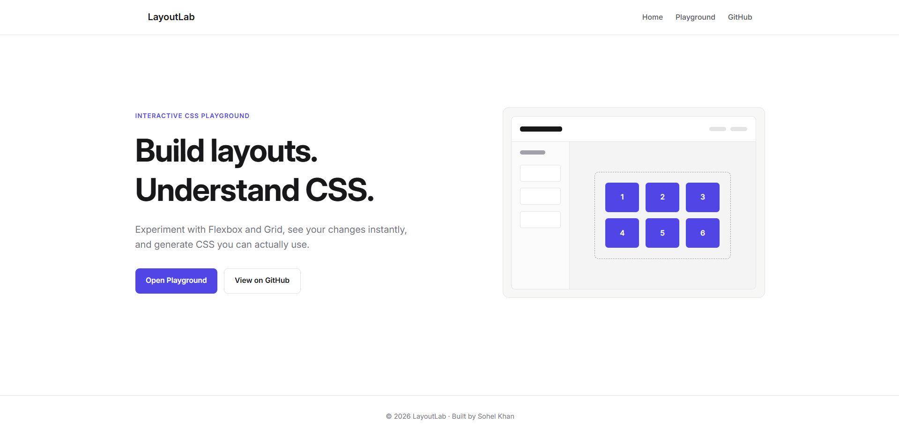
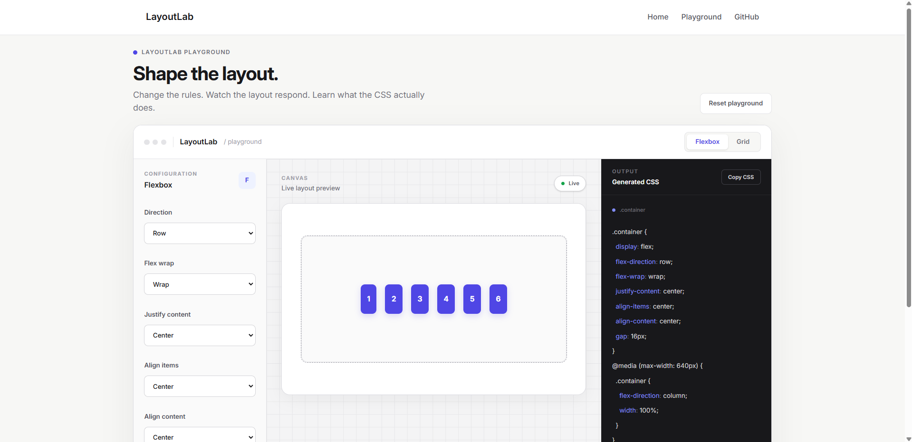
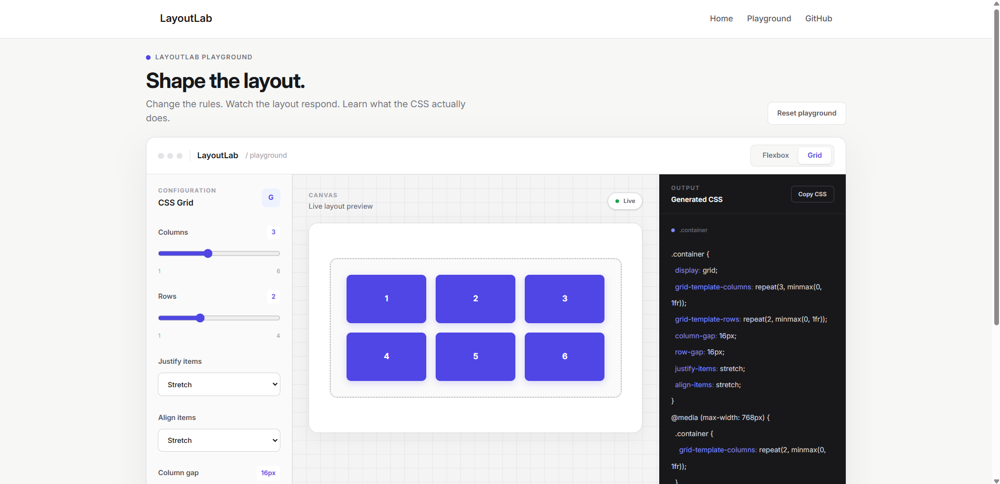
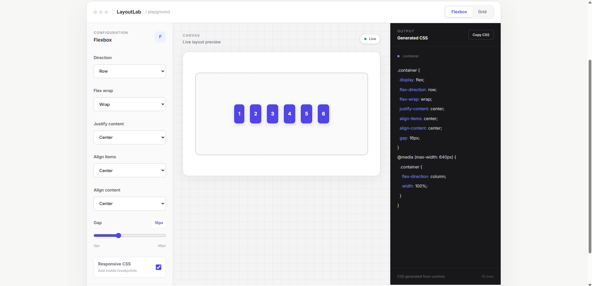
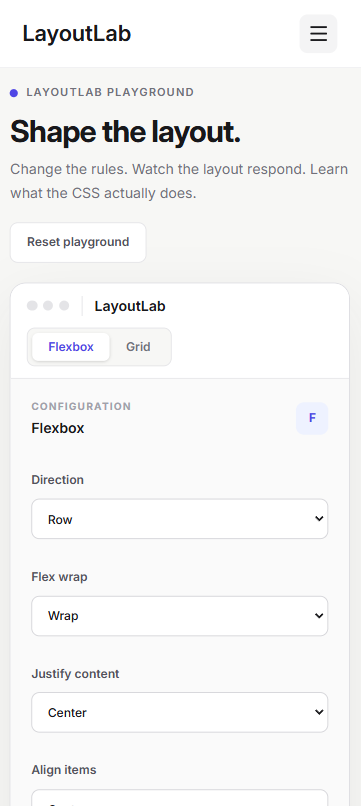

# LayoutLab

Interactive CSS layout playground built with React and Tailwind CSS as part of the DevConnect Verified Frontend Internship, run by Vyren.

---

## Live Demo

[LayoutLab](https://layoutlab-2026.netlify.app/)

---

## Screenshots

### Desktop Homepage



### Flexbox Playground



### Grid Playground



### Responsive CSS Output



### Mobile Playground



---

## Overview

LayoutLab is an interactive CSS layout playground that allows users to experiment with Flexbox and CSS Grid through a visual interface.

The playground provides layout controls, a live preview, and generated CSS based on the current configuration. The goal is to make CSS layout concepts easier to understand by allowing users to change properties and immediately see their effect.

---

## Features

- Flexbox playground
- CSS Grid playground
- Interactive layout controls
- Live layout preview
- Flexbox direction, wrapping, alignment, justification, and spacing controls
- Grid columns, rows, alignment, and spacing controls
- Responsive layout support
- Responsive CSS generation
- Generated CSS output
- Copy CSS functionality
- Reset playground configuration
- Responsive navigation
- Mobile-friendly interface
- Accessible form controls and labels

---

## Accessibility

Accessibility was considered throughout the interface to keep the playground usable with standard keyboard and assistive technology interactions.

The project includes:

- Accessible labels for form controls
- Semantic HTML elements
- Keyboard-accessible interactive controls
- Visible focus states
- Accessible navigation controls
- Responsive layouts across different screen sizes

---

## Responsive Design

LayoutLab is designed to adapt across desktop, tablet, and mobile screen sizes.

The interface uses responsive layouts so that the navigation, controls, preview area, and generated CSS remain usable on smaller screens.

The playground can also generate responsive CSS rules based on the selected configuration when responsive behavior is enabled.

---

## Design Approach

The interface follows a clean and minimal visual style focused on the functionality of the playground.

The design uses:

- White and off-white surfaces
- Indigo as the primary accent color
- Thin borders
- Restrained rounded corners
- Strong typography
- Minimal shadows
- Dark generated CSS panel

The goal was to create a focused developer tool rather than a generic dashboard-style interface.

---

## Pages

### Home

The home page introduces LayoutLab and provides access to the playground and project repository.

### Playground

The playground provides the interactive Flexbox and CSS Grid controls, live preview, responsive options, generated CSS, copy functionality, and reset functionality.

---

## Components

- `Layout` — Provides the shared page layout and renders the navigation, page content, and footer.
- `Navbar` — Handles desktop navigation and the responsive mobile navigation menu.
- `Footer` — Provides the shared footer.
- `Home` — Contains the LayoutLab landing page.
- `Playground` — Contains the interactive CSS layout playground and its controls.

---

## Tech Stack

### Frontend

- React
- JavaScript
- Tailwind CSS
- React Router
- Vite

### Tools

- Git
- GitHub
- VS Code
- Netlify

---

## Project Structure

```text
devconnect-css-layout-playground/
├── public/
│   ├── favicon.png
│   └── _redirects
├── screenshots/
│   ├── desktop-homepage.png
│   ├── flexbox-playground.png
│   ├── grid-playground.png
│   ├── mobile-playground.png
│   └── responsive-css-output.png
├── src/
│   ├── assets/
│   ├── Common/
│   │   ├── Footer.jsx
│   │   ├── Home.jsx
│   │   └── Navbar.jsx
│   ├── Components/
│   │   ├── Layout.jsx
│   │   └── Playground.jsx
│   ├── App.jsx
│   ├── index.css
│   └── main.jsx
├── .gitignore
├── eslint.config.js
├── index.html
├── package.json
├── package-lock.json
└── README.md
```

---

## Getting Started

### Prerequisites

Make sure you have Node.js and npm installed.

### Installation

Clone the repository:

```bash
git clone https://github.com/sohelkhan-07/devconnect-css-layout-playground.git
```

Navigate to the project directory:

```bash
cd devconnect-css-layout-playground
```

Install the dependencies:

```bash
npm install
```

Start the development server:

```bash
npm run dev
```

The application will be available at the local development URL provided by Vite.

---

## Usage

1. Open the LayoutLab playground.
2. Choose between Flexbox and Grid.
3. Adjust the available layout controls.
4. Observe the changes in the live preview.
5. Enable responsive behavior when needed.
6. Review the generated CSS.
7. Copy the generated CSS when needed.
8. Use Reset to return to the default configuration.

---

## Deployment

LayoutLab is a frontend-only React application deployed using Netlify.

Live application:

https://layoutlab-2026.netlify.app/

---

## Testing

The application was tested during development across different viewport sizes and playground configurations.

Testing focused on:

- Flexbox controls
- CSS Grid controls
- Live preview updates
- Generated CSS updates
- Responsive CSS generation
- Copy CSS functionality
- Reset functionality
- Responsive navigation
- Mobile layouts
- Narrow viewport behavior
- Generated CSS panel behavior

---

## Key Implementation Decisions

### Shared State for the Playground

React state is used to store the current playground configuration.

The same state controls both the live preview and the generated CSS so that the preview and CSS output remain synchronized.

### Conditional Layout Controls

Flexbox and CSS Grid use different layout properties.

The playground therefore displays the relevant controls based on the selected layout mode.

### Dynamic CSS Generation

The generated CSS is created from the current playground configuration rather than being static.

This allows the CSS output to update whenever the user changes a layout property.

### Responsive CSS Generation

When responsive behavior is enabled, LayoutLab generates media queries based on the current layout configuration.

### CSS Generation with `useMemo`

The generated CSS is derived using React's `useMemo` so the CSS output is recalculated when the relevant playground settings change.

### Clipboard Functionality

The generated CSS can be copied directly using the browser Clipboard API.

---

## DevConnect Requirements Covered

This project was created as the final project for the **DevConnect Verified Frontend Internship, run by Vyren**.

The project focuses on:

- Interactive frontend development
- Responsive design
- CSS layout concepts
- React state management
- Accessible user interactions
- Dynamic CSS generation
- Clear project documentation
- Practical frontend implementation

---

## Project Decision Record

The following decisions were the most expensive to reverse during the project.

### Decision 1: React for the application architecture

**What was decided**

I chose React as the frontend framework and structured the application using reusable components and React state.

**Alternatives considered**

- Plain HTML, CSS, and JavaScript
- React
- Next.js

**Why this decision**

React provided a straightforward way to manage the interactive playground state and keep the live preview and generated CSS synchronized.

It also allowed the application to be divided into reusable components such as `Navbar`, `Layout`, `Home`, `Footer`, and `Playground`.

**What it costs**

Using React adds framework and dependency overhead compared with a plain HTML, CSS, and JavaScript implementation.

It also requires React-specific knowledge and project structure that would not be necessary for a smaller static application.

---

### Decision 2: Frontend-only architecture

**What was decided**

I decided to keep LayoutLab entirely frontend-only without a backend or database.

**Alternatives considered**

- Frontend-only React application
- React with a Node.js/Express backend
- A backend with database storage for playground configurations

**Why this decision**

The main purpose of LayoutLab is experimenting with CSS layouts and generating CSS from the current configuration.

The application does not require user accounts, persistent data, or server-side processing, so adding a backend would increase complexity without being necessary for the core experience.

**What it costs**

Users cannot save playground configurations to an account or access previously saved layouts from another device.

The application is also limited to functionality that can be handled entirely in the browser.

---

### Decision 3: Dynamic CSS generation

**What was decided**

I chose to generate CSS directly from the playground configuration and display it alongside the live preview.

**Alternatives considered**

- Showing only the visual preview
- Providing predefined CSS examples
- Dynamically generating CSS from the current configuration

**Why this decision**

The goal of LayoutLab is not only to experiment visually but also to help users understand how CSS properties affect a layout.

Showing the generated CSS makes the relationship between the controls and the resulting CSS explicit.

**What it costs**

Keeping the preview and generated CSS synchronized makes the implementation more complex.

Every supported control has to be correctly reflected in both the live preview and CSS generation logic.

**What proved awkward**

Responsive CSS generation proved more awkward than initially expected.

Supporting media queries while keeping the generated CSS synchronized with the live preview required additional logic and made this part of the implementation harder to maintain.

---

## What I Practiced

Through this project, I practiced:

- React state management
- Conditional rendering
- `useMemo`
- Flexbox
- CSS Grid
- Responsive CSS
- Dynamic CSS generation
- Clipboard API
- Responsive UI design
- Accessible form controls
- Component-based React architecture
- Git and GitHub workflow
- Frontend deployment

---

## Future Improvements

Possible future improvements include:

- Additional Flexbox properties
- Additional CSS Grid properties
- Individual item controls
- Layout presets
- More responsive configuration options
- Additional CSS layout techniques

---

## Status

**Completed, reviewed, and deployed as part of the DevConnect Verified Frontend Internship, run by Vyren.**

---

## Author

**Sohel Khan**

GitHub: https://github.com/sohelkhan-07

LinkedIn: https://www.linkedin.com/in/sohelkhan07/

